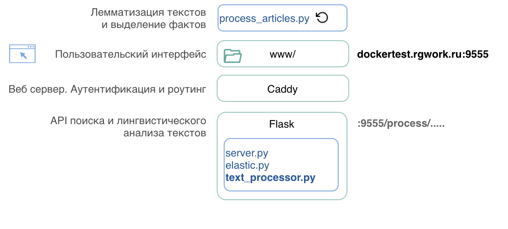

# text-processor

**API первичного анализа текстовых данных** в рамках построения рекомендательной системы RGRU.

Первичный анализ включает , лемматизацию слов, 
нормализацию выражений, морфологический анализ слов,
синтаксический анализ предложений, очистку текста от стоп слов 
HTML разметки, выделение именованных сущностей, дат, адресов, денежных сумм.

<a href="http://dockertest.rgwork.ru:9555">GUI доступа к API</a>

<a target="_blank" href="https://viewer.diagrams.net/?highlight=0000ff&edit=_blank&layers=1&nav=1&title=RG%20NLP%20project.drawio#Uhttps%3A%2F%2Fdrive.google.com%2Fuc%3Fid%3D1yflDpag5TSUrKPRsHgFzR2sBhjBY_7tz%26export%3Ddownload">Общая схема проектов</a>





-----------------------------------------


API
----

**Конечные точки**

- /**search** - поиск материалов тематически связанных с данным текстом.
  
  Может содержать следующие параметры, показанные со значениями по умолчанию:

  - limit=20 - максимальное количество материалов в ответе
  - skip=0 - пропустить количество записей
  - field=lemmatized_text - поле по которому осуществляется поиск. Может быть 
    full_text, title, announce, link_title, uannounce, lemmatized_text, entities
  - timeout=5s - максимальное время выполнения поиска
  - lemmatize=true - если false, не лемматизировать и не очищать запрос от стоп слов.
  - from_date='2000-01-01' искать документы позже даты
  - to_date='2030-01-01' искать документы до (не включая) даты
  
  <br><br>

- /**lemmas-entities** - возвращает лемматизированный текст и список сущностей 
- /**clear-lemmas-entities** - возвращает лемматизированный, очищенный от стоп-слов текст и список сущностей
- /**entities** - возвращает список сущностей
- /**syntax** - текст дерева синтаксического разбора
- /**list-lemma-vec** - список word2vec векторов слов
- /**extract**/{ names | dates | addr| money } выделение имен, дат, адресов, сумм

Примеры использования API в файле `deploy/www/index.html`.

Request
-------

Запросы ко всем конечным точкам имеют форму:
``` json
POST
Content-Type: application/json

{
    "text": "\n<p>Глава государства ..."
}
'
```

Текст может содержать HTML разметку, которая будет удалена перед выполнением операций.

Response
------

```json
{
      "lemmatized_text": "глава государство  ...", // лемматизированный текст
      "cleared": true|false,      // очищен ли текст
      "entities": {               // Список  сущностей сгруппированный по типам
            "PER": {              // Персоны
                  "Голубев": 4,   // 4 - количество вхождений в текст
                  "Путин": 3,
                  "Владимир Путин": 1,
                  "Александр Лукашенко": 2
            },
            "LOC": {             // Места
                  "Ростовская область": 3,
                  "Республика  Беларусь": 1,
                  "Кремль": 1
            }
      },
      "time": 0.17,               // время в секундах, которое занял анализ текста
      "lemm_num": 524,            // Количество лемм в тексте
      "lemm_num_cleared": 396,    // Количество лемм после очистки
      "host": "text-processor-1", // Имя хоста обработавшего текст
}

```


Требования к системе
---------

- docker
- python > 3.7.6
- go > 1.14.2
- pip install -r requirements.txt 

Чтобы не засорять компьютер лишними библиотеками, 
рекомендуется создать python environment.
Если установлена anaconda можно выполнить:

      conda create -n text_processor python=3.7.6  
      conda deactivate 
      conda activate text_processor
      pip install -r requirements.txt 


Команды
--------
Выполняются из корневой директории.


Старт сервера

      sh/server-up.sh  

Останов сервера
   
      sh/server-down.sh   

Старт записных книжек

      sh/notebooks-up.sh  

Останов записных книжек

      sh/notebooks-down.sh


Тест библиотек

      python tests/test-text-processor.py 


Тесты запросов к серверу

      tests/test-post.sh   
      python tests/test-post.py 
      go run tests/*.go  

Код 
----

находится в директории deploy/


Замечания
---------

Похоже библиотеки обработки текстов используют все доступные процессоры.
Поэтому никакие ухищрения по распараллеливанию операций, 
например организация нескольких реплик серверов не приводит к значимым результатам.
Похоже даже параллельные запросы становятся в очередь.
Максимум чего удалось добиться путём организации четырёх реплик и балансера нагрузки 
в docker-compose, это снижение времени исполнения запроса с 0.28 до 0.18 секунды 
на локальном компьютере с четырьмя процессорами.


Запуск программы
------------

Перейдите в директорию deploy/.

**Веб приложение в докере:**
      
      docker-compose up -d --build


**Веб приложение без докера:**

      python server.py

Откройте http://localhost:9555


**Запуск процессора новых статей**

      ./build-push.sh
      docker run -rm -it -e ...  vadimivlev/text-processor:latest ?????

or 

      python process_articles.py

To build the image and upload it to docker hub :

      ./build-worker-image.sh

## Notes

Sometimes process_articles.py crushes because of lack of memory. This happens when processed text is big.
Then docker restarts the container and process_articles.py continues leaving several records in the database unprocessed with 
process_status = 'processing'.


curl -XPOST "http://13.79.79.34:9094/elasticsearch/_sql?format=txt" -H 'Content-Type: application/json' -d'{  "query": "SELECT obj_id FROM articles where process_status = '\''success'\'' limit 10000"}'

curl -XPOST "http://dockertest.rgwork.ru:9094/elasticsearch/_sql?format=txt" -H 'Content-Type: application/json' -d'{  "query": "SELECT obj_id FROM articles where process_status = '\''success'\'' limit 10000"}'
 